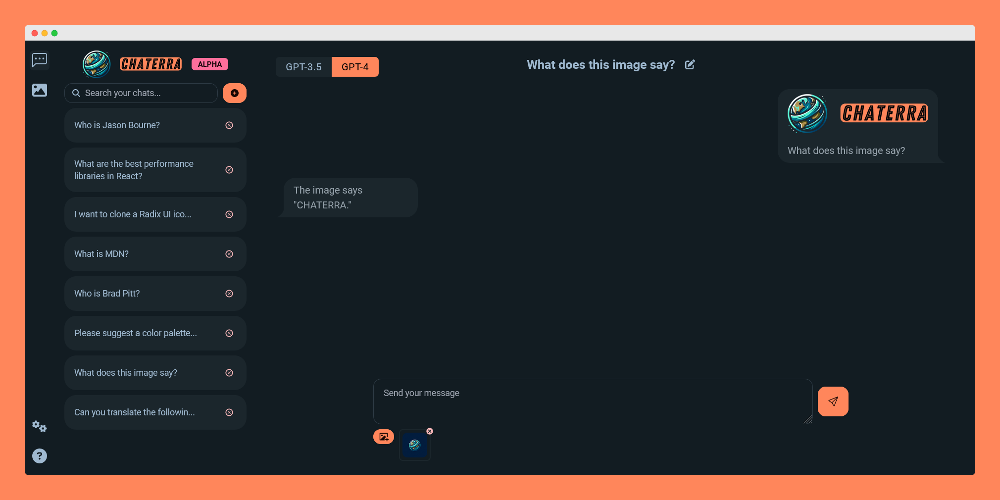

# Chaterra

<p align="center">
    
    <p align="center">🌎 An alternative ChatGPT frontend </p>
</p>

## Overview

Chaterra is a web-based frontend for OpenAI's GPT and DALL-E models. It is designed to be a simple and easy-to-use user interface that allows you to take advantage of the usage-based pricing model of OpenAI's API.

Chaterra stores all data in the browser and since [OpenAI does not use their API platform to train their models](https://help.openai.com/en/articles/5722486-how-your-data-is-used-to-improve-model-performance), it can be used as a privacy-friendly alternative to the official ChatGPT frontend.

## Screenshot



## Local quickstart

1. Clone the repository

```term
$ git clone https://github.com/exler/chaterra
```

2. Install dependencies

```term
$ bun install
```

3. Run the development server

```term
$ bun run dev
```

4. Create a production build

```term
$ bun run build
```

Optionally, you can preview it before deploying it to a remote server:
```term
$ bun run preview
```

## License

`Chaterra` is under the terms of the [MIT License](https://www.tldrlegal.com/l/mit), following all clarifications stated in the [license file](LICENSE).
